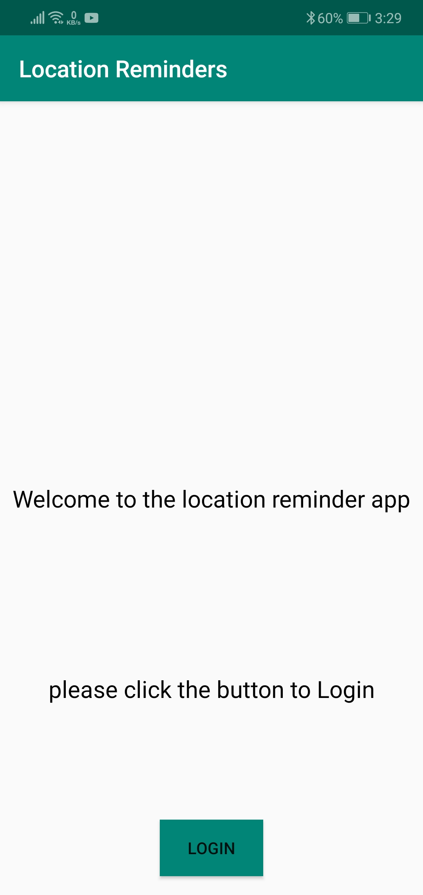

# Location Reminder

A Todo list app with location reminders that remind the user to do something when he reaches a specific location. The app will require the user to create an account and login to set and access reminders.

## Getting Started

1. Clone the project to your local machine.
2. Open the project using Android Studio.

### Dependencies

```
1. A created project on Firebase console.
2. A create a project on Google console.
```

### Installation

Step by step explanation of how to get a dev environment running.

```
1. To enable Firebase Authentication:
        a. Go to the authentication tab at the Firebase console and enable Email/Password and Google Sign-in methods.
        b. download `google-services.json` and add it to the app.
2. To enable Google Maps:
    a. Go to APIs & Services at the Google console.
    b. Select your project and go to APIs & Credentials.
    c. Create a new api key and restrict it for android apps.
    d. Add your package name and SHA-1 signing-certificate fingerprint.
    c. Enable Maps SDK for Android from API restrictions and Save.
    d. Copy the api key to the `google_maps_api.xml`
3. Run the app on your mobile phone or emulator with Google Play Services in it.
```

## Testing

Right click on the `test` or `androidTest` packages and select Run Tests

### Break Down Tests

Explain what each test does and why

```
1.androidTest
    - RemindersDaoTest.kt: Testing the save and update methods of the Dao and Room database.
    - RemindersLocalRepositoryTest.kt: Testing the repository saving and retrieving methods.
    - ReminderListFragmentTest.kt: Testing the navigation from the ReminderListFragment to adding a reminder, and if the correct screen is shown when there are no reminders.
    - RemindersActivityTest.kt: End-to-end Testing to check if a reminder can be added successfully and if the reminder can't be added when there is no title or location
2. test
    - RemindersListViewModelTest.kt: Testing the methods of the mentioned viewModel, testing to see if it is loading, and if it retrieves the correct data, and testing to see if it throws an error when there is no reminders.
    - SaveReminderViewModelTest.kt: Testing the methods of the mentioned viewModel, Testing of the validation of data, the saving of data, and clearing of the viewModel.
```

## Project Instructions

    1. Create a Login screen to ask users to login using an email address or a Google account.  Upon successful login, navigate the user to the Reminders screen.   If there is no account, the app should navigate to a Register screen.
    2. Create a Register screen to allow a user to register using an email address or a Google account.
    3. Create a screen that displays the reminders retrieved from local storage. If there are no reminders, display a   "No Data"  indicator.  If there are any errors, display an error message.
    4. Create a screen that shows a map with the user's current location and asks the user to select a point of interest to create a reminder.
    5. Create a screen to add a reminder when a user reaches the selected location.  Each reminder should include
        a. title
        b. description
        c. selected location
    6. Reminder data should be saved to local storage.
    7. For each reminder, create a geofencing request in the background that fires up a notification when the user enters the geofencing area.
    8. Provide testing for the ViewModels, Coroutines and LiveData objects.
    9. Create a FakeDataSource to replace the Data Layer and test the app in isolation.
    10. Use Espresso and Mockito to test each screen of the app:
        a. Test DAO (Data Access Object) and Repository classes.
        b. Add testing for the error messages.
        c. Add End-To-End testing for the Fragments navigation.

## Student Deliverables:

1. APK file of the final project.
2. Git Repository with the code.

## Built With

* [Koin](https://github.com/InsertKoinIO/koin) - A pragmatic lightweight dependency injection framework for Kotlin.
* [FirebaseUI Authentication](https://github.com/firebase/FirebaseUI-Android/blob/master/auth/README.md) - FirebaseUI provides a drop-in auth solution that handles the UI flows for signing
* [JobIntentService](https://developer.android.com/reference/androidx/core/app/JobIntentService) - Run background service from the background application, Compatible with >= Android O.

## Screenshot



